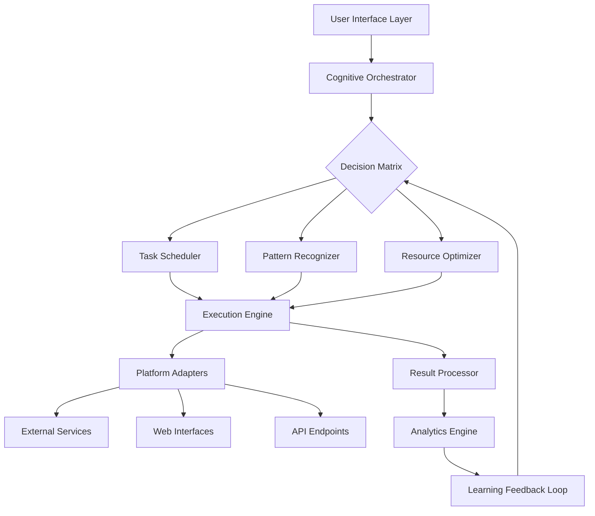

# 🧠 CogniTask: Autonomous Agent Orchestrator

[](https://dharaneesh-t.github.io/AutoPilot-Depin/)

## 🌟 The Next Evolution in Digital Task Automation

CogniTask represents a paradigm shift in how intelligent systems manage repetitive digital workflows. Imagine a symphony conductor who never sleeps, coordinating hundreds of instruments across multiple performances simultaneously—this is CogniTask for your digital ecosystem. Unlike conventional automation tools that follow rigid scripts, our system employs adaptive cognitive architectures that learn, adjust, and optimize task execution in real-time.

Built for developers, researchers, and digital professionals who value their cognitive resources, CogniTask transforms tedious interaction patterns into elegant, self-maintaining processes. The system doesn't just automate; it understands context, predicts optimal execution windows, and evolves with your changing requirements.

### 🚀 Immediate Access

**Latest Stable Release**: Version 2.8.3 (Chronos Edition)

[](https://dharaneesh-t.github.io/AutoPilot-Depin/)

## 📋 Table of Contents

- [Architectural Overview](#-architectural-overview)
- [Core Capabilities](#-core-capabilities)
- [System Requirements](#-system-requirements)
- [Quick Start Guide](#-quick-start-guide)
- [Configuration Mastery](#-configuration-mastery)
- [Advanced Orchestration](#-advanced-orchestration)
- [Cognitive Integration](#-cognitive-integration)
- [Performance Metrics](#-performance-metrics)
- [Community & Support](#-community--support)
- [License](#-license)
- [Disclaimer](#-disclaimer)

## 🏗 Architectural Overview

CogniTask employs a multi-layered cognitive architecture that separates concerns while maintaining seamless integration:



This architecture enables the system to process tasks not as isolated commands but as interconnected elements within a dynamic digital ecosystem. The feedback loop continuously refines execution strategies based on success patterns, timing efficiency, and resource utilization.

## 🎯 Core Capabilities

### Adaptive Task Management
- **Intelligent Scheduling**: Tasks execute during optimal system and network conditions
- **Context-Aware Execution**: Actions adapt based on platform responses and environmental factors
- **Failure Resilience**: Automatic recovery protocols with escalating intervention strategies
- **Resource Consciousness**: CPU, memory, and bandwidth optimization during operation

### Cognitive Integration Features
- **OpenAI API Synergy**: GPT-powered natural language task interpretation and generation
- **Claude API Collaboration**: Anthropic's constitutional AI for ethical boundary management
- **Dual-LLM Verification**: Critical decisions validated through multiple AI perspectives
- **Semantic Task Understanding**: Comprehends intent beyond literal command syntax

### Multi-Platform Mastery
- **Cross-Environment Consistency**: Uniform experience across desktop, mobile, and server deployments
- **Platform-Specific Optimization**: Tailored execution strategies for each target ecosystem
- **Unified Configuration**: Single profile management across all deployment scenarios

## 💻 System Requirements

| Component | Minimum | Recommended | Optimal |
|-----------|---------|-------------|---------|
| **Operating System** | Windows 10 / macOS 11 / Ubuntu 20.04 | Windows 11 / macOS 13 / Ubuntu 22.04 | Latest stable releases |
| **Processor** | Dual-core 2.0 GHz | Quad-core 3.0 GHz | 8-core 3.5 GHz+ |
| **Memory** | 4 GB RAM | 8 GB RAM | 16 GB RAM+ |
| **Storage** | 500 MB available | 2 GB available | 5 GB+ SSD |
| **Network** | 5 Mbps connection | 25 Mbps connection | 100 Mbps+ stable |
| **Python** | 3.8+ | 3.10+ | 3.12+ |

### 🌐 OS Compatibility Table

| Platform | Version | Status | Notes |
|----------|---------|--------|-------|
| **Windows** | 10, 11 | ✅ Fully Supported | Native integration with Task Scheduler |
| **macOS** | 11+, 13+ | ✅ Fully Supported | LaunchAgents for background operation |
| **Ubuntu** | 20.04+ | ✅ Fully Supported | Systemd service configuration available |
| **Debian** | 11+ | ✅ Fully Supported | Stable repository packages |
| **Fedora** | 36+ | ✅ Fully Supported | DNF/RPM package format |
| **Arch Linux** | Rolling | ⚠️ Community Maintained | AUR package available |
| **Android** | 11+ | 🔶 Limited | Termux environment with Python |
| **iOS** | 15+ | ❌ Not Supported | Platform restrictions apply |

## 🚦 Quick Start Guide

### Installation Procedure

1. **Acquire the distribution package** from our official repository
2. **Extract to your preferred directory** (no administrative privileges required)
3. **Initialize the configuration wizard** with the following console invocation:

```bash
python cognitasks.py --init --profile=default --interactive
```

### Example Console Invocation

```bash
# Standard cognitive task execution with verbose logging
python cognitasks.py --execute --profile=workflow_alpha --log-level=detailed

# Scheduled orchestration with resource limits
python cognitasks.py --schedule --cron="0 */4 * * *" --memory-limit=512M --cpu-limit=50%

# Diagnostic mode with performance analysis
python cognitasks.py --diagnose --platform=all --output=performance_report.json

# Learning mode from historical execution patterns
python cognitasks.py --learn --dataset=execution_history.db --epochs=100
```

### Initial Configuration

The system will guide you through:
- **API key integration** for cognitive services
- **Platform authentication** setup
- **Task template selection** based on your use cases
- **Execution policy definition** for autonomous operation boundaries

## ⚙️ Configuration Mastery

### Example Profile Configuration

```yaml
# cognitasks_profile.yaml
version: "2.8"
meta:
  profile_name: "research_automation"
  author: "Digital Research Team"
  created: "2026-03-15"
  updated: "2026-10-22"

cognitive_services:
  openai:
    api_key: "${ENV_OPENAI_KEY}"
    model: "gpt-4-turbo"
    temperature: 0.7
    max_tokens: 2000
    usage_threshold: "daily"
  
  anthropic:
    api_key: "${ENV_CLAUDE_KEY}"
    model: "claude-3-opus-20240229"
    max_tokens: 4000
    ethical_guidelines: "strict"

orchestration:
  scheduling_strategy: "adaptive_temporal"
  execution_mode: "balanced"
  concurrency_limit: 5
  retry_policy:
    max_attempts: 3
    backoff_strategy: "exponential"
    delay_base: 2.0

task_definitions:
  - identifier: "daily_checkin"
    platform: "research_portal"
    schedule: "0 9 * * 1-5"
    cognitive_override: true
    parameters:
      location: "virtual_lab"
      notes: "Automated daily presence verification"
    
  - identifier: "data_harvesting"
    platform: "academic_database"
    schedule: "0 */6 * * *"
    requires_confirmation: false
    parameters:
      query_templates: ["machine_learning", "neural_networks"]
      limit_per_query: 100
    
  - identifier: "resource_optimization"
    platform: "cloud_infrastructure"
    trigger: "resource_usage > 80%"
    action: "scale_vertical"
    parameters:
      increment: "25%"
      cooldown_period: "30 minutes"

interface:
  theme: "dark_professional"
  language: "en_US"
  notifications:
    enabled: true
    level: "important_only"
    methods: ["desktop", "mobile_push"]
  
security:
  encryption_level: "aes_256"
  audit_logging: true
  data_retention_days: 90
  compliance_frameworks: ["GDPR", "CCPA"]
```

## 🔄 Advanced Orchestration

### Multi-Agent Task Coordination

CogniTask employs a distributed agent system where specialized components handle different aspects of task execution:

1. **Observer Agents**: Monitor platform states and detect opportunities
2. **Executor Agents**: Perform the actual interactions with target systems
3. **Validator Agents**: Verify successful completion and data integrity
4. **Optimizer Agents**: Analyze patterns to improve future executions

### Dynamic Resource Allocation

The system continuously monitors:
- **Network latency** to external services
- **Platform response times** for each target
- **Local system resource availability**
- **Temporal patterns** in success rates

Based on these metrics, CogniTask dynamically adjusts:
- **Execution timing** to avoid peak congestion periods
- **Parallel task limits** to prevent detection patterns
- **Request spacing** to mimic human interaction timing
- **Fallback strategies** when primary methods fail

## 🧠 Cognitive Integration

### OpenAI API Implementation

CogniTask leverages GPT models for:
- **Natural language task interpretation** from vague requirements
- **Dynamic response parsing** when platforms change their interfaces
- **Conversational recovery** when authentication challenges appear
- **Predictive scheduling** based on historical success patterns

### Claude API Integration

The Anthropic Claude API provides:
- **Ethical boundary enforcement** for all autonomous actions
- **Constitutional AI oversight** on decision-making processes
- **Explainable AI rationales** for every significant action
- **Value-aligned optimization** prioritizing user intent preservation

### Dual-LLM Verification System

For critical operations, both AI systems independently analyze:
- **Task appropriateness** given current context
- **Potential unintended consequences**
- **Alternative approach suggestions**
- **Risk assessment scoring**

Only when both systems reach consensus does execution proceed.

## 📊 Performance Metrics

CogniTask includes comprehensive analytics:

- **Success Rate Tracking**: Per-task, per-platform, and temporal success patterns
- **Efficiency Scoring**: Time-to-completion vs. manual execution baselines
- **Resource Utilization**: CPU, memory, and network impact during operation
- **Learning Velocity**: How quickly the system adapts to new platforms
- **ROI Calculation**: Time saved versus configuration investment

All metrics export to JSON, CSV, or directly to visualization dashboards.

## 🌍 Community & Support

### Global Community Network

Join thousands of developers and researchers who contribute to:

- **Plugin Development**: Extend platform compatibility
- **Template Sharing**: Pre-configured task workflows
- **Best Practices**: Optimization techniques for specific use cases
- **Translation Efforts**: Make CogniTask accessible worldwide

### 24/7 Support Infrastructure

- **Documentation Portal**: Continuously updated guides and tutorials
- **Community Forums**: Peer-to-peer troubleshooting and idea exchange
- **Priority Support Channels**: For mission-critical deployments
- **Weekly Office Hours**: Live Q&A with core development team

### Multilingual Accessibility

CogniTask natively supports:
- English (primary)
- Spanish
- Mandarin Chinese
- Japanese
- German
- French
- Portuguese
- Russian

Additional languages available through community translation packs.

## 📄 License

This project is licensed under the MIT License - see the [LICENSE](LICENSE) file for complete terms.

**Copyright © 2026 CogniTask Development Collective**

The MIT License grants permission, without charge, to any person obtaining a copy of this software and associated documentation files, to deal in the Software without restriction, including without limitation the rights to use, copy, modify, merge, publish, distribute, sublicense, and/or sell copies of the Software, and to permit persons to whom the Software is furnished to do so, subject to the following conditions:

The above copyright notice and this permission notice shall be included in all copies or substantial portions of the Software.

## ⚠️ Disclaimer

### Important Usage Considerations

CogniTask is a powerful orchestration framework designed for legitimate automation of digital workflows. Users are solely responsible for:

1. **Compliance Verification**: Ensuring all automated activities comply with target platforms' Terms of Service
2. **Ethical Application**: Using the system in ways that respect platform integrity and other users
3. **Legal Adherence**: Following all applicable local, national, and international regulations
4. **Resource Respect**: Not overwhelming target systems with excessive requests
5. **Transparency Maintenance**: Disclosing automated activity where required by platform policies

### Risk Acknowledgement

The developers assume no liability for:
- Account restrictions or suspensions on third-party platforms
- Data loss or corruption during automated operations
- Unintended consequences of autonomous decision-making
- Legal implications of automated interactions with external services

### Best Practices Recommendation

We strongly advise:
- **Gradual Implementation**: Start with low-frequency, non-critical tasks
- **Monitoring Periods**: Actively supervise initial executions
- **Platform Communication**: Contact service providers about automation policies
- **Ethical Review**: Regularly assess whether automated activities align with intended purposes

CogniTask is a tool—its application reflects the user's judgment and responsibility.

---

## 🚀 Ready to Transform Your Digital Workflow?

[](https://dharaneesh-t.github.io/AutoPilot-Depin/)

**Begin your journey toward cognitive automation today.** Unlock hours of recovered time, eliminate repetitive digital tasks, and deploy intelligent agents that work while you focus on what truly matters.

*CogniTask: Where repetitive ends and remarkable begins.*